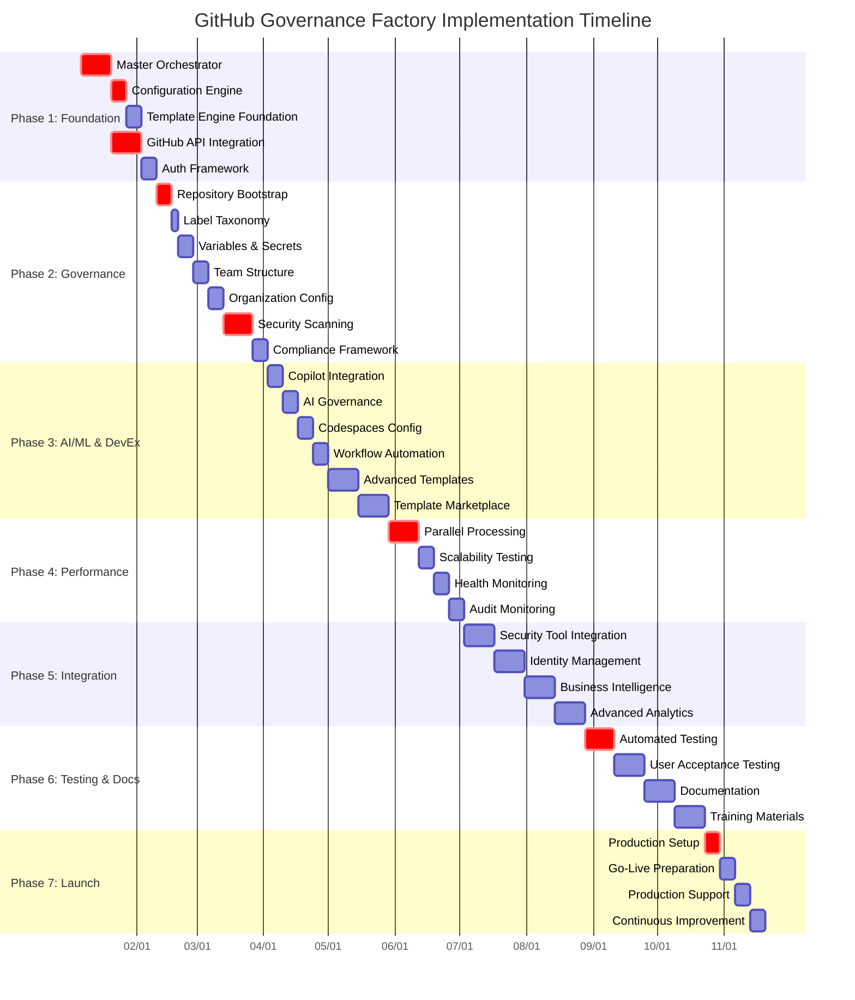

# GitHub Governance Factory Service - Implementation Tasks

## 1. Project Overview

This document outlines the comprehensive implementation tasks for the GitHub Governance Factory Service - a universal, zero-hardcoded bootstrap engine that transforms ANY GitHub organization or repository into a fully governed, enterprise-ready development ecosystem. The implementation follows a structured approach to deliver a reusable governance platform that scales from personal accounts to Fortune 500 enterprises.

## 2. Implementation Phases

### Phase 1: Universal Foundation Architecture (Weeks 1-4)

#### 1.1 Core Orchestrator Framework
**Priority**: Critical | **Status**: 📋 PLANNED

**Task 1.1.1**: Cross-Platform Master Orchestrator Development
- **Description**: Develop master orchestrator scripts for Windows (.bat) and Linux/Mac (.sh) with feature parity
- **Deliverables**:
  - `setup-github.bat` - Windows PowerShell compatible implementation
  - `setup-github.sh` - Bash/Zsh compatible implementation
  - Cross-platform parameter processing and validation
  - Unified error handling and user feedback
- **Acceptance Criteria**:
  - [ ] Identical functionality across Windows, Linux, and macOS
  - [ ] Parameter-driven execution with zero hardcoded values
  - [ ] Comprehensive error handling with recovery procedures
  - [ ] User-friendly progress reporting and logging
- **Dependencies**: None
- **Estimate**: 2 weeks
- **Assignee**: Lead Platform Engineer

**Task 1.1.2**: Configuration Engine Implementation
- **Description**: Implement unified configuration management with multiple input sources
- **Deliverables**:
  - Environment variable processing and validation
  - CLI argument parsing and override logic
  - Interactive prompting for missing parameters
  - Configuration file (.env) support with defaults
  - Parameter validation and confirmation workflows
- **Acceptance Criteria**:
  - [ ] Support for ORG_NAME, REPO_NAME, PROJECT_TITLE parameters
  - [ ] Hierarchical configuration (CLI > ENV > .env > prompts > defaults)
  - [ ] Comprehensive validation preventing invalid configurations
  - [ ] Clear user guidance for configuration errors
- **Dependencies**: Task 1.1.1
- **Estimate**: 1 week
- **Assignee**: Senior Backend Developer

**Task 1.1.3**: Template Engine Foundation
- **Description**: Develop flexible template system supporting multiple project types
- **Deliverables**:
  - Template selection logic and validation
  - Template metadata and configuration schema
  - Basic template library with 5 core templates
  - Template customization framework
  - Template versioning and upgrade procedures
- **Acceptance Criteria**:
  - [ ] Intelligent template selection based on project context
  - [ ] Template customization without code modification
  - [ ] Template validation preventing configuration errors
  - [ ] Template upgrade procedures tested and documented
- **Dependencies**: Task 1.1.2
- **Estimate**: 1 week
- **Assignee**: Senior Frontend Developer

#### 1.2 GitHub API Integration Layer
**Priority**: Critical | **Status**: 📋 PLANNED

**Task 1.2.1**: GitHub API Client Implementation
- **Description**: Comprehensive GitHub API integration with rate limiting and error handling
- **Deliverables**:
  - GitHub REST API client with authentication
  - GitHub GraphQL API client for complex queries
  - Rate limiting and quota management
  - Retry logic with exponential backoff
  - API error handling and user feedback
- **Acceptance Criteria**:
  - [ ] Complete coverage of required GitHub API endpoints
  - [ ] Intelligent rate limiting preventing API quota exhaustion
  - [ ] Retry logic handling transient failures gracefully
  - [ ] Clear error messages with actionable remediation guidance
- **Dependencies**: Task 1.1.1
- **Estimate**: 2 weeks
- **Assignee**: Senior Backend Developer

**Task 1.2.2**: Authentication and Authorization Framework
- **Description**: Multi-tier authentication supporting different access levels
- **Deliverables**:
  - GitHub CLI authentication validation
  - Personal Access Token (PAT) support
  - GitHub App integration for enterprise scenarios
  - Permission validation and scope checking
  - Multi-tier access control (personal, team, enterprise)
- **Acceptance Criteria**:
  - [ ] Support for GitHub CLI, PAT, and GitHub App authentication
  - [ ] Automatic permission validation before execution
  - [ ] Clear error messages for insufficient permissions
  - [ ] Graceful handling of authentication failures
- **Dependencies**: Task 1.2.1
- **Estimate**: 1 week
- **Assignee**: Security Engineer

### Phase 2: Comprehensive Governance Implementation (Weeks 5-8)

#### 2.1 Repository Infrastructure Management
**Priority**: Critical | **Status**: 📋 PLANNED

**Task 2.1.1**: Repository Bootstrap Engine
- **Description**: Complete repository setup with governance controls
- **Deliverables**:
  - Repository creation with security settings
  - Branch protection and merge policies
  - Repository settings and metadata configuration
  - Initial repository structure and documentation
  - Repository health validation and reporting
- **Acceptance Criteria**:
  - [ ] Idempotent repository creation preventing conflicts
  - [ ] Comprehensive branch protection with quality gates
  - [ ] Professional repository structure with documentation
  - [ ] Repository health validation after setup
- **Dependencies**: Task 1.2.2
- **Estimate**: 1 week
- **Assignee**: DevOps Engineer

**Task 2.1.2**: Label Taxonomy Implementation
- **Description**: Deploy enterprise-grade label system with 17+ categories
- **Deliverables**:
  - Epic/Feature/Task hierarchy labels
  - Priority and status classification labels
  - Component and area-specific labels
  - Label color coding and consistency standards
  - Label documentation and usage guidelines
- **Acceptance Criteria**:
  - [ ] Complete label taxonomy with 17+ categories
  - [ ] Consistent color coding and naming conventions
  - [ ] Label usage documentation and guidelines
  - [ ] Automated label deployment and validation
- **Dependencies**: Task 2.1.1
- **Estimate**: 0.5 weeks
- **Assignee**: Junior Developer

**Task 2.1.3**: Repository Variables and Secrets Management
- **Description**: Deploy repository variables and secrets with secure practices
- **Deliverables**:
  - 23+ CI/CD and operational variables
  - 12+ repository secrets with secure generation
  - Secret rotation procedures and documentation
  - Variable and secret validation and testing
  - Security best practices implementation
- **Acceptance Criteria**:
  - [ ] Complete variable set for CI/CD operations
  - [ ] Securely generated secrets with rotation procedures
  - [ ] Variable and secret validation preventing misconfigurations
  - [ ] Security best practices documented and implemented
- **Dependencies**: Task 2.1.2
- **Estimate**: 1 week
- **Assignee**: Security Engineer

#### 2.2 Organization Infrastructure Management
**Priority**: High | **Status**: 📋 PLANNED

**Task 2.2.1**: Team Structure and Permissions
- **Description**: Create hierarchical team structure with role-based access control
- **Deliverables**:
  - Core team structure (engineering, security, operations)
  - Role-based access control (RBAC) implementation
  - Team permission matrix and validation
  - Team membership management procedures
  - Permission audit and compliance reporting
- **Acceptance Criteria**:
  - [ ] Complete team hierarchy with appropriate permissions
  - [ ] RBAC implementation following security best practices
  - [ ] Team permission validation and audit capabilities
  - [ ] Clear team membership management procedures
- **Dependencies**: Task 2.1.3
- **Estimate**: 1 week
- **Assignee**: Platform Engineer

**Task 2.2.2**: Organization-Level Configuration
- **Description**: Configure organization-wide policies and settings
- **Deliverables**:
  - Organization secrets and variables deployment
  - Organization security policies and compliance
  - Organization metadata and branding configuration
  - Organization-wide workflow and policy templates
  - Organization health monitoring and reporting
- **Acceptance Criteria**:
  - [ ] Organization secrets and variables properly scoped
  - [ ] Security policies enforced at organization level
  - [ ] Professional organization profile and branding
  - [ ] Organization health monitoring and validation
- **Dependencies**: Task 2.2.1
- **Estimate**: 1 week
- **Assignee**: Platform Engineer

#### 2.3 Security Framework Implementation
**Priority**: Critical | **Status**: 📋 PLANNED

**Task 2.3.1**: Multi-Layer Security Scanning
- **Description**: Implement comprehensive security scanning and vulnerability management
- **Deliverables**:
  - CodeQL security scanning configuration
  - Dependabot vulnerability management setup
  - Secret scanning with custom patterns
  - Container security scanning integration
  - Security workflow automation and reporting
- **Acceptance Criteria**:
  - [ ] CodeQL scanning for all supported languages
  - [ ] Dependabot configuration for all package ecosystems
  - [ ] Secret scanning preventing credential exposure
  - [ ] Automated security workflow with reporting
- **Dependencies**: Task 2.2.2
- **Estimate**: 2 weeks
- **Assignee**: Security Engineer

**Task 2.3.2**: Compliance and Audit Framework
- **Description**: Implement compliance validation and audit reporting
- **Deliverables**:
  - Compliance framework for SOX, GDPR, HIPAA
  - Audit trail generation and storage
  - Compliance reporting and validation
  - Security policy enforcement and monitoring
  - Compliance gap analysis and remediation
- **Acceptance Criteria**:
  - [ ] Compliance validation for major regulatory frameworks
  - [ ] Complete audit trails for all governance operations
  - [ ] Automated compliance reporting and validation
  - [ ] Compliance gap analysis with remediation guidance
- **Dependencies**: Task 2.3.1
- **Estimate**: 1 week
- **Assignee**: Compliance Specialist

### Phase 3: AI/ML Governance and Developer Experience (Weeks 9-12)

#### 3.1 AI/ML Governance Framework
**Priority**: High | **Status**: 📋 PLANNED

**Task 3.1.1**: GitHub Copilot Business Integration
- **Description**: Implement comprehensive GitHub Copilot governance
- **Deliverables**:
  - GitHub Copilot Business licensing and seat management
  - Team-based AI access controls and restrictions
  - AI usage policies and documentation
  - Copilot configuration and optimization
  - AI audit trails and compliance reporting
- **Acceptance Criteria**:
  - [ ] Copilot Business licensing configured and managed
  - [ ] Team-based access controls preventing unauthorized AI usage
  - [ ] AI usage policies documented and enforced
  - [ ] Complete AI audit trails for compliance
- **Dependencies**: Task 2.3.2
- **Estimate**: 1 week
- **Assignee**: AI/ML Specialist

**Task 3.1.2**: AI Context Boundaries and Model Governance
- **Description**: Implement AI context filtering and model governance
- **Deliverables**:
  - Context filtering protecting sensitive information
  - Model governance with approved AI models only
  - AI decision audit trails and documentation
  - AI risk assessment and mitigation procedures
  - AI governance monitoring and reporting
- **Acceptance Criteria**:
  - [ ] Context boundaries protecting enterprise secrets
  - [ ] Model governance restricting to approved models only
  - [ ] AI decision audit trails for compliance
  - [ ] AI risk assessment and mitigation documented
- **Dependencies**: Task 3.1.1
- **Estimate**: 1 week
- **Assignee**: AI/ML Specialist

#### 3.2 Developer Experience Optimization
**Priority**: Medium | **Status**: 📋 PLANNED

**Task 3.2.1**: Codespaces Configuration and Management
- **Description**: Implement standardized development environments
- **Deliverables**:
  - Pre-configured Codespaces with development tools
  - Development container standardization
  - IDE configuration and extension management
  - Development workflow automation
  - Developer onboarding acceleration
- **Acceptance Criteria**:
  - [ ] One-click Codespaces environment setup
  - [ ] Standardized development tools and extensions
  - [ ] Development workflow automation for common tasks
  - [ ] Developer onboarding time reduced by 80%
- **Dependencies**: Task 3.1.2
- **Estimate**: 1 week
- **Assignee**: Developer Experience Engineer

**Task 3.2.2**: Workflow and Template Automation
- **Description**: Implement automated workflows and documentation templates
- **Deliverables**:
  - GitHub Actions workflow templates
  - Issue and pull request templates
  - Professional documentation templates (README, CONTRIBUTING)
  - Automated workflow generation and customization
  - Workflow performance monitoring and optimization
- **Acceptance Criteria**:
  - [ ] Comprehensive workflow templates for common scenarios
  - [ ] Professional documentation templates with guidance
  - [ ] Automated workflow customization and deployment
  - [ ] Workflow performance monitoring and optimization
- **Dependencies**: Task 3.2.1
- **Estimate**: 1 week
- **Assignee**: DevOps Engineer

#### 3.3 Template Marketplace and Customization
**Priority**: Medium | **Status**: 📋 PLANNED

**Task 3.3.1**: Advanced Template Engine
- **Description**: Expand template system with 17+ specialized templates
- **Deliverables**:
  - Web application template with frontend/backend separation
  - Microservice template with container orchestration
  - Data platform template with ML/AI capabilities
  - Security framework template with enhanced controls
  - Documentation and tutorial templates
- **Acceptance Criteria**:
  - [ ] 17+ specialized templates covering major use cases
  - [ ] Template selection wizard with intelligent recommendations
  - [ ] Template customization without code modification
  - [ ] Template documentation and usage examples
- **Dependencies**: Task 3.2.2
- **Estimate**: 2 weeks
- **Assignee**: Template Architect

**Task 3.3.2**: Template Marketplace and Community Features
- **Description**: Implement template sharing and community collaboration
- **Deliverables**:
  - Template marketplace with search and discovery
  - Community template submission and validation
  - Template rating and review system
  - Template versioning and update management
  - Template contribution guidelines and documentation
- **Acceptance Criteria**:
  - [ ] Template marketplace with search and filtering
  - [ ] Community template validation and quality assurance
  - [ ] Template versioning with automated update procedures
  - [ ] Template contribution workflow documented
- **Dependencies**: Task 3.3.1
- **Estimate**: 2 weeks
- **Assignee**: Community Manager + Senior Developer

### Phase 4: Performance, Monitoring, and Optimization (Weeks 13-16)

#### 4.1 Performance Optimization and Scalability
**Priority**: High | **Status**: 📋 PLANNED

**Task 4.1.1**: Parallel Processing and Performance Optimization
- **Description**: Implement parallel processing and performance optimization
- **Deliverables**:
  - Parallel processing for independent governance components
  - Performance optimization based on organization size
  - Resource usage monitoring and optimization
  - Progress tracking and user feedback during operations
  - Performance benchmarking and validation
- **Acceptance Criteria**:
  - [ ] Parallel processing reducing setup time by 50%
  - [ ] Performance optimization for different organization sizes
  - [ ] Real-time progress tracking with accurate estimates
  - [ ] Performance benchmarks meeting target specifications
- **Dependencies**: Task 3.3.2
- **Estimate**: 2 weeks
- **Assignee**: Performance Engineer

**Task 4.1.2**: Scalability Testing and Validation
- **Description**: Validate scalability across organization types and sizes
- **Deliverables**:
  - Scalability testing for personal accounts through enterprises
  - Load testing with realistic organization scenarios
  - Performance regression testing and monitoring
  - Scalability documentation and optimization guidelines
  - Capacity planning and resource estimation tools
- **Acceptance Criteria**:
  - [ ] Scalability validated from 1 to 1000+ repositories
  - [ ] Performance targets met across all organization types
  - [ ] Regression testing preventing performance degradation
  - [ ] Capacity planning tools for deployment estimation
- **Dependencies**: Task 4.1.1
- **Estimate**: 1 week
- **Assignee**: QA Engineer + Performance Engineer

#### 4.2 Monitoring and Observability
**Priority**: Medium | **Status**: 📋 PLANNED

**Task 4.2.1**: Health Monitoring and Validation
- **Description**: Implement comprehensive health monitoring and validation
- **Deliverables**:
  - Post-setup health validation and reporting
  - Governance drift detection and alerting
  - Performance monitoring and trend analysis
  - Error detection and automated recovery
  - Health dashboard and visualization
- **Acceptance Criteria**:
  - [ ] Comprehensive health validation after setup completion
  - [ ] Governance drift detection with automated alerts
  - [ ] Performance monitoring with trend analysis
  - [ ] Health dashboard providing real-time status
- **Dependencies**: Task 4.1.2
- **Estimate**: 1 week
- **Assignee**: Monitoring Engineer

**Task 4.2.2**: Audit and Compliance Monitoring
- **Description**: Implement comprehensive audit and compliance monitoring
- **Deliverables**:
  - Real-time audit event processing and storage
  - Compliance monitoring and validation
  - Audit report generation and visualization
  - Compliance dashboard for executive visibility
  - Audit trail integrity verification and validation
- **Acceptance Criteria**:
  - [ ] Real-time audit event processing with correlation
  - [ ] Compliance monitoring with automated validation
  - [ ] Executive dashboard providing compliance visibility
  - [ ] Audit trail integrity verified and documented
- **Dependencies**: Task 4.2.1
- **Estimate**: 1 week
- **Assignee**: Compliance Engineer

### Phase 5: Integration and Enterprise Features (Weeks 17-20)

#### 5.1 Enterprise System Integration
**Priority**: Low | **Status**: 📋 PLANNED

**Task 5.1.1**: External Security Tool Integration
- **Description**: Integrate with external security and compliance tools
- **Deliverables**:
  - SonarQube integration for code quality analysis
  - Veracode integration for security scanning
  - Enterprise vulnerability management integration
  - Security information and event management (SIEM) integration
  - Security dashboard and reporting integration
- **Acceptance Criteria**:
  - [ ] SonarQube integration providing enhanced code quality analysis
  - [ ] Veracode integration for comprehensive security scanning
  - [ ] SIEM integration for security event correlation
  - [ ] Security dashboard providing unified visibility
- **Dependencies**: Task 4.2.2
- **Estimate**: 2 weeks
- **Assignee**: Integration Engineer

**Task 5.1.2**: Enterprise Identity and Access Management
- **Description**: Integrate with enterprise identity providers and access management
- **Deliverables**:
  - Azure Active Directory (Azure AD) integration
  - LDAP and SAML integration for enterprise authentication
  - Single sign-on (SSO) configuration and management
  - Identity synchronization and user provisioning
  - Access governance and compliance reporting
- **Acceptance Criteria**:
  - [ ] Azure AD integration with seamless SSO
  - [ ] LDAP/SAML integration for enterprise identity providers
  - [ ] Identity synchronization preventing access drift
  - [ ] Access governance with compliance reporting
- **Dependencies**: Task 5.1.1
- **Estimate**: 2 weeks
- **Assignee**: Identity Management Specialist

#### 5.2 Business Intelligence and Reporting
**Priority**: Low | **Status**: 📋 PLANNED

**Task 5.2.1**: Executive Dashboard and Business Intelligence
- **Description**: Implement executive dashboard and business intelligence
- **Deliverables**:
  - Executive dashboard with KPIs and metrics
  - Portfolio-level governance visibility and reporting
  - Business intelligence integration and analytics
  - Cost optimization and resource utilization reporting
  - Strategic governance insights and recommendations
- **Acceptance Criteria**:
  - [ ] Executive dashboard providing strategic visibility
  - [ ] Portfolio governance with cross-project analytics
  - [ ] Cost optimization recommendations and reporting
  - [ ] Strategic insights driving governance improvements
- **Dependencies**: Task 5.1.2
- **Estimate**: 2 weeks
- **Assignee**: Business Intelligence Analyst

**Task 5.2.2**: Advanced Analytics and Machine Learning
- **Description**: Implement advanced analytics and predictive capabilities
- **Deliverables**:
  - Predictive analytics for project success probability
  - Governance pattern analysis and optimization recommendations
  - Anomaly detection for security and compliance violations
  - Machine learning models for intelligent automation
  - Advanced reporting and visualization capabilities
- **Acceptance Criteria**:
  - [ ] Predictive analytics providing project success insights
  - [ ] Governance optimization recommendations based on patterns
  - [ ] Anomaly detection preventing security and compliance violations
  - [ ] Machine learning enhancing governance automation
- **Dependencies**: Task 5.2.1
- **Estimate**: 2 weeks
- **Assignee**: Data Scientist + ML Engineer

### Phase 6: Documentation, Testing, and Deployment (Weeks 21-24)

#### 6.1 Comprehensive Testing and Validation
**Priority**: Critical | **Status**: 📋 PLANNED

**Task 6.1.1**: Automated Testing Suite
- **Description**: Implement comprehensive automated testing across all components
- **Deliverables**:
  - Unit tests for all governance components with 90%+ coverage
  - Integration tests for GitHub API interactions
  - End-to-end tests for complete governance workflows
  - Security testing and vulnerability validation
  - Performance testing and regression validation
- **Acceptance Criteria**:
  - [ ] 90%+ code coverage with meaningful unit tests
  - [ ] Integration tests validating GitHub API interactions
  - [ ] End-to-end tests covering complete governance workflows
  - [ ] Security tests preventing vulnerabilities and misconfigurations
- **Dependencies**: Task 5.2.2
- **Estimate**: 2 weeks
- **Assignee**: QA Engineer + Test Automation Engineer

**Task 6.1.2**: User Acceptance Testing and Validation
- **Description**: Conduct comprehensive user acceptance testing with real scenarios
- **Deliverables**:
  - User acceptance test scenarios for all personas
  - Beta testing with real organizations and projects
  - User experience validation and optimization
  - Performance validation under realistic conditions
  - Security and compliance validation with audit simulation
- **Acceptance Criteria**:
  - [ ] User acceptance tests passing for all primary personas
  - [ ] Beta testing validation with positive user feedback
  - [ ] Performance validated under realistic organizational loads
  - [ ] Security and compliance validated through audit simulation
- **Dependencies**: Task 6.1.1
- **Estimate**: 2 weeks
- **Assignee**: QA Lead + Beta Testing Team

#### 6.2 Documentation and Knowledge Management
**Priority**: High | **Status**: 📋 PLANNED

**Task 6.2.1**: Comprehensive Documentation Development
- **Description**: Create comprehensive documentation for all users and use cases
- **Deliverables**:
  - User guides for different personas (developer, platform engineer, security)
  - Installation and setup documentation with examples
  - Template documentation and customization guides
  - Troubleshooting and FAQ documentation
  - API documentation and integration guides
- **Acceptance Criteria**:
  - [ ] User guides covering all primary personas and use cases
  - [ ] Installation documentation with step-by-step examples
  - [ ] Template documentation enabling easy customization
  - [ ] Troubleshooting guides resolving common issues
- **Dependencies**: Task 6.1.2
- **Estimate**: 2 weeks
- **Assignee**: Technical Writer + Documentation Team

**Task 6.2.2**: Training and Knowledge Transfer
- **Description**: Develop training materials and knowledge transfer programs
- **Deliverables**:
  - Interactive tutorials and getting started guides
  - Video training series for different use cases
  - Certification program for advanced users
  - Community forum and knowledge base setup
  - Training materials for enterprise deployments
- **Acceptance Criteria**:
  - [ ] Interactive tutorials enabling self-service onboarding
  - [ ] Video training covering all major use cases
  - [ ] Certification program validating user competency
  - [ ] Community forum fostering collaboration and support
- **Dependencies**: Task 6.2.1
- **Estimate**: 2 weeks
- **Assignee**: Training Specialist + Community Manager

### Phase 7: Production Deployment and Launch (Weeks 25-28)

#### 7.1 Production Deployment and Release Management
**Priority**: Critical | **Status**: 📋 PLANNED

**Task 7.1.1**: Production Environment Setup
- **Description**: Configure production environment and release infrastructure
- **Deliverables**:
  - Production hosting and distribution infrastructure
  - Automated release pipeline and deployment procedures
  - Production monitoring and alerting configuration
  - Backup and disaster recovery procedures
  - Production security configuration and hardening
- **Acceptance Criteria**:
  - [ ] Production infrastructure providing 99.9% availability
  - [ ] Automated release pipeline with quality gates
  - [ ] Production monitoring with comprehensive alerting
  - [ ] Disaster recovery procedures tested and validated
- **Dependencies**: Task 6.2.2
- **Estimate**: 1 week
- **Assignee**: DevOps Lead + Infrastructure Engineer

**Task 7.1.2**: Go-Live and Launch Preparation
- **Description**: Prepare for production launch with marketing and community engagement
- **Deliverables**:
  - Launch marketing and communication strategy
  - Community engagement and adoption programs
  - Support procedures and escalation processes
  - Success metrics and KPI monitoring setup
  - Launch event and demonstration planning
- **Acceptance Criteria**:
  - [ ] Launch marketing generating initial adoption and awareness
  - [ ] Community engagement fostering collaboration and feedback
  - [ ] Support procedures providing responsive user assistance
  - [ ] Success metrics providing visibility into adoption and value
- **Dependencies**: Task 7.1.1
- **Estimate**: 1 week
- **Assignee**: Product Marketing Manager + Community Manager

#### 7.2 Post-Launch Support and Optimization
**Priority**: High | **Status**: 📋 PLANNED

**Task 7.2.1**: Production Support and Maintenance
- **Description**: Establish production support and continuous maintenance procedures
- **Deliverables**:
  - 24/7 support procedures and escalation processes
  - Incident response and resolution procedures
  - Continuous monitoring and optimization processes
  - User feedback collection and analysis procedures
  - Maintenance and update procedures
- **Acceptance Criteria**:
  - [ ] Support procedures providing rapid incident resolution
  - [ ] Continuous monitoring preventing service degradation
  - [ ] User feedback driving continuous improvement
  - [ ] Maintenance procedures ensuring system reliability
- **Dependencies**: Task 7.1.2
- **Estimate**: 1 week
- **Assignee**: Support Team Lead + Operations Engineer

**Task 7.2.2**: Continuous Improvement and Enhancement
- **Description**: Establish continuous improvement processes and enhancement planning
- **Deliverables**:
  - User feedback analysis and prioritization processes
  - Feature enhancement planning and roadmap development
  - Performance optimization and scaling procedures
  - Community contribution and collaboration processes
  - Long-term strategic planning and evolution roadmap
- **Acceptance Criteria**:
  - [ ] User feedback driving feature enhancement prioritization
  - [ ] Performance optimization maintaining service quality
  - [ ] Community contributions enhancing platform capabilities
  - [ ] Strategic roadmap guiding long-term platform evolution
- **Dependencies**: Task 7.2.1
- **Estimate**: 1 week
- **Assignee**: Product Manager + Engineering Leadership

## 3. Task Dependencies and Critical Path

### 3.1 Critical Path Analysis



### 3.2 Risk Dependencies

**High-Risk Dependencies**:
1. **GitHub API Rate Limiting** (Tasks 1.2.1, 2.1.1, 2.2.1)
   - Risk: API rate limits could impact large-scale operations
   - Mitigation: Implement intelligent batching and rate limit management
   - Contingency: Implement graceful degradation and retry logic

2. **Cross-Platform Compatibility** (Tasks 1.1.1, 4.1.2, 6.1.1)
   - Risk: Platform differences could cause functionality gaps
   - Mitigation: Extensive cross-platform testing and validation
   - Contingency: Platform-specific implementations where necessary

3. **GitHub API Changes** (Tasks 1.2.1, 2.3.1, 3.1.1)
   - Risk: GitHub API changes could break functionality
   - Mitigation: API versioning and backward compatibility
   - Contingency: Rapid update procedures and fallback mechanisms

**Medium-Risk Dependencies**:
1. **Template Complexity** (Tasks 1.1.3, 3.3.1, 3.3.2)
   - Risk: Template system complexity could impact maintainability
   - Mitigation: Modular template architecture and comprehensive testing
   - Contingency: Simplified template system with reduced customization

2. **Performance at Scale** (Tasks 4.1.1, 4.1.2, 5.2.2)
   - Risk: Performance degradation with large organizations
   - Mitigation: Performance testing and optimization
   - Contingency: Horizontal scaling and performance tuning

## 4. Resource Allocation and Team Structure

### 4.1 Team Composition

**Core Development Team** (16 FTE total):
- **Lead Platform Engineer** (1 FTE) - Overall technical leadership and architecture
- **Senior Backend Developer** (2 FTE) - API integration and core orchestrator
- **Senior Frontend Developer** (1 FTE) - Template engine and user experience
- **DevOps Engineer** (2 FTE) - Infrastructure and deployment automation
- **Security Engineer** (2 FTE) - Security scanning and compliance framework
- **QA Engineer** (2 FTE) - Testing automation and validation
- **Performance Engineer** (1 FTE) - Performance optimization and scalability
- **Integration Engineer** (1 FTE) - External system integration
- **Technical Writer** (2 FTE) - Documentation and training materials
- **Product Manager** (1 FTE) - Requirements and stakeholder management
- **Community Manager** (1 FTE) - Community engagement and support

**Specialized Consultants** (As needed):
- **AI/ML Specialist** (0.5 FTE) - GitHub Copilot governance
- **Compliance Specialist** (0.5 FTE) - Regulatory compliance
- **Identity Management Specialist** (0.5 FTE) - Enterprise identity integration
- **Business Intelligence Analyst** (0.5 FTE) - Executive dashboard and analytics
- **Data Scientist** (0.5 FTE) - Advanced analytics and ML
- **Template Architect** (0.5 FTE) - Template design and marketplace

### 4.2 Sprint Organization

**Sprint Duration**: 2 weeks  
**Total Sprints**: 14 sprints over 28 weeks

**Sprint Planning**:
- **Sprints 1-2**: Foundation architecture and core orchestrator
- **Sprints 3-4**: GitHub API integration and repository governance
- **Sprints 5-6**: Organization management and security framework
- **Sprints 7-8**: AI/ML governance and developer experience
- **Sprints 9-10**: Performance optimization and monitoring
- **Sprints 11-12**: Enterprise integration and business intelligence
- **Sprints 13-14**: Testing, documentation, and production deployment

### 4.3 Capacity Planning

**Development Capacity** (per sprint):
- **Development Points**: 80 story points per sprint (16 FTE × 5 points)
- **Testing Points**: 20 story points per sprint (dedicated QA capacity)
- **Documentation Points**: 10 story points per sprint (dedicated tech writing)

**Total Project Capacity**:
- **Development**: 1,120 story points (14 sprints × 80 points)
- **Testing**: 280 story points (14 sprints × 20 points)
- **Documentation**: 140 story points (14 sprints × 10 points)

## 5. Quality Assurance and Testing Strategy

### 5.1 Testing Framework

**Multi-Layer Testing Approach**:
1. **Unit Testing** (90% coverage target)
   - Individual component testing with mocks
   - Configuration validation testing
   - Template engine testing
   - API client testing

2. **Integration Testing** (95% API coverage)
   - GitHub API integration testing
   - Cross-service integration validation
   - Template rendering and deployment testing
   - Security scanner integration testing

3. **End-to-End Testing** (100% workflow coverage)
   - Complete governance workflow testing
   - Multi-organization scenario testing
   - Performance and scalability testing
   - Security and compliance validation testing

4. **User Acceptance Testing** (All personas)
   - Individual developer scenario testing
   - Platform engineer enterprise testing
   - Security engineer compliance testing
   - Business stakeholder dashboard testing

### 5.2 Testing Automation

**Continuous Integration Pipeline**:
```yaml
# CI/CD Testing Pipeline
testing_pipeline:
  stages:
    - name: "Unit Tests"
      coverage_threshold: 90%
      failure_action: "block_merge"
      
    - name: "Integration Tests"  
      api_coverage: 95%
      mock_external_services: true
      
    - name: "Security Tests"
      vulnerability_scanning: true
      compliance_validation: true
      
    - name: "Performance Tests"
      load_testing: true
      scalability_validation: true
      
    - name: "E2E Tests"
      browser_testing: false  # CLI tool
      workflow_validation: true
      
  quality_gates:
    - code_coverage: ">= 90%"
    - security_vulnerabilities: "= 0 critical"
    - performance_regression: "< 5%"
    - user_acceptance: ">= 95% pass rate"
```

### 5.3 Performance Testing

**Performance Benchmarks**:
```yaml
# Performance Testing Scenarios
performance_scenarios:
  personal_account:
    repositories: 1-5
    setup_time: "< 5 minutes"
    parallel_jobs: 2
    
  team_organization:
    repositories: 5-50
    teams: 3-10
    setup_time: "< 10 minutes"
    parallel_jobs: 4
    
  enterprise_organization:
    repositories: 50-500
    teams: 10-100
    setup_time: "< 15 minutes"
    parallel_jobs: 8
    
  performance_metrics:
    - api_response_time: "< 2 seconds (95th percentile)"
    - github_api_efficiency: "> 80% optimal"
    - memory_usage: "< 1GB peak"
    - network_efficiency: "> 90% successful operations"
```

## 6. Risk Management and Mitigation

### 6.1 Technical Risks

**Risk 1: GitHub API Rate Limiting and Stability**
- **Probability**: High
- **Impact**: High
- **Mitigation Strategy**:
  - Implement intelligent API batching and rate limit monitoring
  - Use GitHub GraphQL API for complex queries to reduce API calls
  - Implement exponential backoff and retry logic for transient failures
  - Cache API responses where appropriate to reduce redundant calls
- **Contingency Plan**:
  - Graceful degradation with offline configuration options
  - Manual fallback procedures for critical operations
  - Alternative authentication methods for different scenarios

**Risk 2: Cross-Platform Compatibility Issues**
- **Probability**: Medium
- **Impact**: High
- **Mitigation Strategy**:
  - Extensive testing on Windows, Linux, and macOS
  - Use platform-agnostic tools and libraries where possible
  - Implement platform-specific optimizations where necessary
  - Continuous integration testing on all target platforms
- **Contingency Plan**:
  - Platform-specific implementations for critical components
  - Docker container option for consistent environment
  - Community contributions for platform-specific fixes

**Risk 3: Template System Complexity and Maintainability**
- **Probability**: Medium
- **Impact**: Medium
- **Mitigation Strategy**:
  - Modular template architecture with clear separation of concerns
  - Comprehensive template validation and testing procedures
  - Template versioning and backward compatibility management
  - Community review process for template contributions
- **Contingency Plan**:
  - Simplified template system with reduced customization options
  - Focus on core templates with proven value
  - Template migration tools for backward compatibility

### 6.2 Business Risks

**Risk 4: Adoption and User Acceptance**
- **Probability**: Medium
- **Impact**: High
- **Mitigation Strategy**:
  - Extensive user research and persona validation
  - Beta testing program with real organizations
  - Comprehensive documentation and training materials
  - Community engagement and feedback integration
- **Contingency Plan**:
  - Enhanced marketing and education campaigns
  - Additional training and support resources
  - Simplified onboarding and user experience improvements

**Risk 5: Competition and Market Changes**
- **Probability**: Medium
- **Impact**: Medium
- **Mitigation Strategy**:
  - Focus on comprehensive feature coverage and quality
  - Strong community engagement and contribution ecosystem
  - Rapid iteration and feature development
  - Strategic partnerships and integrations
- **Contingency Plan**:
  - Accelerated feature development and differentiation
  - Enhanced enterprise features and support
  - Open source strategy for community adoption

### 6.3 Security and Compliance Risks

**Risk 6: Security Vulnerabilities and Configuration Errors**
- **Probability**: Low
- **Impact**: Critical
- **Mitigation Strategy**:
  - Comprehensive security testing and code review
  - Automated vulnerability scanning and monitoring
  - Security-first design principles and best practices
  - Regular security audits and penetration testing
- **Contingency Plan**:
  - Rapid security patch deployment procedures
  - Security incident response and communication plan
  - Security advisory and user notification system

**Risk 7: Compliance Framework Changes**
- **Probability**: Low
- **Impact**: Medium
- **Mitigation Strategy**:
  - Modular compliance framework supporting multiple standards
  - Regular compliance framework review and updates
  - Expert consultation and regulatory monitoring
  - Automated compliance validation and reporting
- **Contingency Plan**:
  - Rapid compliance framework updates and patches
  - Expert consultation for complex compliance requirements
  - Compliance gap analysis and remediation procedures

## 7. Success Criteria and Acceptance

### 7.1 Functional Success Criteria

**Core Functionality**:
- [ ] Single command bootstraps complete GitHub governance for any organization type
- [ ] 100% parameter-driven execution with zero hardcoded values
- [ ] Complete governance coverage across all GitHub domains (repo, org, security, AI/ML)
- [ ] Cross-platform compatibility (Windows, Linux, macOS) with feature parity
- [ ] Template system supporting 17+ specialized project types

**Performance Criteria**:
- [ ] Setup completion in under 15 minutes for 95% of configurations
- [ ] 99.5% successful setup completion rate
- [ ] Linear performance scaling with organization size
- [ ] GitHub API efficiency with intelligent rate limiting

**Security and Compliance**:
- [ ] Security-first configuration with comprehensive controls
- [ ] Complete audit trails for all governance operations
- [ ] Compliance validation for SOX, GDPR, HIPAA frameworks
- [ ] Zero security vulnerabilities in production release

### 7.2 Business Success Criteria

**Adoption Metrics**:
- [ ] 1,000+ successful deployments within 3 months of launch
- [ ] 90% user satisfaction score based on survey feedback
- [ ] 95% setup completion rate (users who start setup complete it)
- [ ] 80% retention rate (users continue using after initial setup)

**Business Value Metrics**:
- [ ] 95% reduction in governance setup time (from days to minutes)
- [ ] 100% governance consistency across all deployments
- [ ] 90% reduction in security configuration errors
- [ ] 80% improvement in developer onboarding time

**Community and Ecosystem**:
- [ ] 100+ community contributions (templates, improvements, bug reports)
- [ ] 50+ organizations using in production environments
- [ ] 10+ enterprise customers with advanced compliance requirements
- [ ] Active community forum with regular engagement

### 7.3 Technical Success Criteria

**Code Quality and Maintainability**:
- [ ] 90%+ code coverage with meaningful tests
- [ ] Zero critical security vulnerabilities
- [ ] Modular architecture enabling easy extension
- [ ] Comprehensive documentation for all components

**Integration and Compatibility**:
- [ ] Complete GitHub API coverage for governance operations
- [ ] Integration with major external security and compliance tools
- [ ] Support for GitHub Enterprise Server and Cloud
- [ ] Extensible architecture for future GitHub features

### 7.4 Acceptance Testing Procedures

**User Acceptance Testing Scenarios**:

1. **Personal Developer Scenario**:
   ```bash
   # Test: Individual developer quick setup
   ./setup-github.bat --org @me --repo "test-project"
   
   # Expected Results:
   # - Setup completes in under 5 minutes
   # - Repository created with professional structure
   # - Security scanning enabled
   # - Codespaces ready for development
   ```

2. **Enterprise Organization Scenario**:
   ```bash
   # Test: Enterprise organization comprehensive setup
   ./setup-github.bat --org "enterprise-corp" --repo "platform-service" --template "microservice"
   
   # Expected Results:
   # - Complete organization governance deployed
   # - Teams and permissions configured
   # - Compliance audit trails generated
   # - Security policies enforced
   ```

3. **Template Customization Scenario**:
   ```bash
   # Test: Custom template deployment
   ./setup-github.bat --org "startup-inc" --template "data-platform" --customize
   
   # Expected Results:
   # - Template customization options presented
   # - Custom configuration applied successfully
   # - Template documentation generated
   # - Governance validation passed
   ```

## 8. Project Timeline and Milestones

### 8.1 Major Milestones

**Milestone 1: Foundation Complete** (Week 4)
- Master orchestrator operational across all platforms
- Configuration engine with parameter validation
- GitHub API integration with rate limiting
- Basic template system functional

**Milestone 2: Core Governance Complete** (Week 8)
- Repository governance with security scanning
- Organization management with team structure
- Security framework with compliance validation
- AI/ML governance with Copilot integration

**Milestone 3: Advanced Features Complete** (Week 12)
- Developer experience optimization with Codespaces
- Advanced template system with marketplace
- Performance optimization and parallel processing
- Health monitoring and audit framework

**Milestone 4: Enterprise Ready** (Week 16)
- External system integration capabilities
- Business intelligence and executive dashboard
- Advanced analytics and machine learning
- Scalability validation and optimization

**Milestone 5: Production Ready** (Week 20)
- Comprehensive testing and validation complete
- Security and compliance audit passed
- Performance benchmarks met
- Documentation and training complete

**Milestone 6: Launch Ready** (Week 24)
- User acceptance testing passed
- Production environment configured
- Support procedures operational
- Community engagement initiated

**Milestone 7: Production Deployed** (Week 28)
- Production launch successful
- Initial user adoption metrics positive
- Support and maintenance procedures operational
- Continuous improvement processes established

### 8.2 Weekly Sprint Goals

**Weeks 1-2 (Sprint 1)**: Foundation Architecture
- Complete master orchestrator framework
- Implement cross-platform parameter processing
- Begin GitHub API integration development

**Weeks 3-4 (Sprint 2)**: Core Orchestrator
- Complete GitHub API integration with authentication
- Implement configuration engine with validation
- Begin template engine development

**Weeks 5-6 (Sprint 3)**: Repository Governance
- Complete repository bootstrap functionality
- Implement label taxonomy and variable management
- Begin organization infrastructure development

**Weeks 7-8 (Sprint 4)**: Organization Management
- Complete team structure and permissions
- Implement organization-level governance
- Begin security framework development

**Weeks 9-10 (Sprint 5)**: Security Framework
- Complete multi-layer security scanning
- Implement compliance validation framework
- Begin AI/ML governance development

**Weeks 11-12 (Sprint 6)**: AI/ML and Developer Experience
- Complete GitHub Copilot governance integration
- Implement Codespaces and developer experience
- Begin advanced template development

**Weeks 13-14 (Sprint 7)**: Template Marketplace
- Complete advanced template system
- Implement template marketplace functionality
- Begin performance optimization development

**Weeks 15-16 (Sprint 8)**: Performance and Monitoring
- Complete parallel processing optimization
- Implement health monitoring and audit framework
- Begin enterprise integration development

**Weeks 17-18 (Sprint 9)**: Enterprise Integration
- Complete external security tool integration
- Implement identity management integration
- Begin business intelligence development

**Weeks 19-20 (Sprint 10)**: Business Intelligence
- Complete executive dashboard and BI integration
- Implement advanced analytics capabilities
- Begin comprehensive testing development

**Weeks 21-22 (Sprint 11)**: Testing and Validation
- Complete automated testing suite
- Implement user acceptance testing framework
- Begin documentation development

**Weeks 23-24 (Sprint 12)**: Documentation and Training
- Complete comprehensive documentation
- Implement training materials and programs
- Begin production environment setup

**Weeks 25-26 (Sprint 13)**: Production Preparation
- Complete production environment configuration
- Implement release and deployment procedures
- Begin go-live preparation

**Weeks 27-28 (Sprint 14)**: Launch and Support
- Complete production launch
- Implement support and maintenance procedures
- Establish continuous improvement processes

---

**Document Version**: 1.0  
**Last Updated**: January 2025  
**Status**: Draft  
**Project Manager**: Platform Engineering Lead  
**Technical Lead**: Senior Architect  
**Stakeholders**: Engineering Leadership, Security Team, Business Operations  
**Next Review**: January 15, 2025
