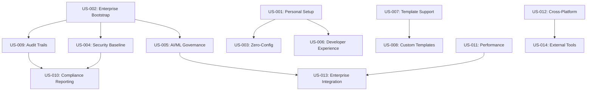

# GitHub Governance Factory Service - User Stories

## 1. Epic Overview

The GitHub Governance Factory Service enables organizations to transform from manual, inconsistent GitHub configurations to enterprise-grade, automated governance in minutes. This epic captures the complete user journey from initial setup through ongoing governance management.

## 2. Personas

### P1: Individual Developer (Personal Account User)
- **Profile**: Solo developer or open-source contributor
- **Goals**: Professional project setup without enterprise complexity
- **Pain Points**: Time-consuming manual setup, inconsistent configurations
- **Technical Level**: Intermediate to Advanced

### P2: Startup Team Lead (Small Organization)
- **Profile**: Technical lead at startup or small company (5-20 developers)
- **Goals**: Professional development practices without enterprise overhead
- **Pain Points**: Scaling consistent practices, security gaps, compliance preparation
- **Technical Level**: Advanced

### P3: Platform Engineer (Enterprise Organization)
- **Profile**: DevOps/Platform engineer at large enterprise (100+ developers)
- **Goals**: Standardized governance across all projects, automation at scale
- **Pain Points**: Manual configuration overhead, compliance requirements, security risks
- **Technical Level**: Expert

### P4: Security Engineer (Enterprise Security Team)
- **Profile**: Security professional responsible for organizational security posture
- **Goals**: Comprehensive security controls, audit trails, compliance validation
- **Pain Points**: Security gaps in manual setups, compliance audit preparation
- **Technical Level**: Expert

### P5: Engineering Manager (Business Leadership)
- **Profile**: Engineering manager responsible for team productivity and governance
- **Goals**: Team productivity, risk management, business value delivery
- **Pain Points**: Governance overhead, compliance costs, setup delays
- **Technical Level**: Intermediate

## 3. User Stories by Epic

### Epic 1: Universal GitHub Bootstrap

#### US-001: Personal Account Quick Setup
**As a** Individual Developer  
**I want** to bootstrap professional GitHub governance for my personal projects  
**So that** I can focus on development while maintaining professional standards

**Acceptance Criteria**:
- [ ] Single command setup: `./setup-github.bat --org @me --repo myproject`
- [ ] Complete setup in under 5 minutes
- [ ] Essential governance without enterprise complexity
- [ ] Professional README, license, and security baseline
- [ ] Pre-configured development environment via Codespaces

**Definition of Done**:
- Personal repository with professional structure and documentation
- Basic security scanning and branch protection
- Development environment ready for immediate use
- Clear documentation for project contributors

**Priority**: High | **Story Points**: 8

---

#### US-002: Enterprise Organization Bootstrap
**As a** Platform Engineer  
**I want** to bootstrap complete enterprise governance for new organizations  
**So that** all projects start with comprehensive security and compliance controls

**Acceptance Criteria**:
- [ ] Support for organization-level governance deployment
- [ ] Complete team structure with role-based access control
- [ ] Organization-wide security policies and compliance controls
- [ ] Portfolio-level project management and reporting
- [ ] Integration with enterprise identity systems

**Definition of Done**:
- Complete organization infrastructure with teams and permissions
- Enterprise-grade security and compliance controls
- Audit-ready documentation and reporting
- Integration with existing enterprise systems

**Priority**: Critical | **Story Points**: 21

---

#### US-003: Zero-Configuration Automation
**As a** Startup Team Lead  
**I want** governance setup with minimal configuration required  
**So that** I can get professional development practices without DevOps expertise

**Acceptance Criteria**:
- [ ] Intelligent defaults for all governance settings
- [ ] Automatic template selection based on project type
- [ ] Minimal user input required (org, repo, project title)
- [ ] Comprehensive governance without technical complexity
- [ ] Clear documentation of what was configured

**Definition of Done**:
- Complete governance setup with 3 parameters or fewer
- Intelligent template selection and configuration
- Professional documentation explaining governance decisions
- Ready-to-use development environment

**Priority**: High | **Story Points**: 13

---

### Epic 2: Comprehensive Governance Coverage

#### US-004: Complete Security Baseline
**As a** Security Engineer  
**I want** comprehensive security controls deployed automatically  
**So that** all projects meet enterprise security standards from day one

**Acceptance Criteria**:
- [ ] CodeQL security scanning for all supported languages
- [ ] Dependabot vulnerability management for all package ecosystems
- [ ] Secret scanning with custom patterns for enterprise systems
- [ ] Branch protection preventing unauthorized changes
- [ ] Security policy templates and documentation

**Definition of Done**:
- Multi-layered security scanning operational
- Branch protection preventing security violations
- Security documentation and policies in place
- Vulnerability management workflows configured

**Priority**: Critical | **Story Points**: 13

---

#### US-005: AI/ML Governance Framework
**As a** Platform Engineer  
**I want** comprehensive GitHub Copilot governance controls  
**So that** AI assistance is enabled with appropriate security boundaries

**Acceptance Criteria**:
- [ ] GitHub Copilot Business licensing and seat management
- [ ] Team-based AI access controls and restrictions
- [ ] Context filtering to protect sensitive information
- [ ] AI usage audit trails and compliance reporting
- [ ] Model governance with approved AI models only

**Definition of Done**:
- Copilot Business activated with appropriate licensing
- Team-based access controls preventing unauthorized AI usage
- Context boundaries protecting enterprise secrets
- Complete AI audit trails for compliance

**Priority**: High | **Story Points**: 8

---

#### US-006: Developer Experience Optimization
**As a** Individual Developer  
**I want** pre-configured development environments and productivity tools  
**So that** I can be productive immediately without setup overhead

**Acceptance Criteria**:
- [ ] One-click Codespaces development environment
- [ ] Pre-configured VS Code with essential extensions
- [ ] Automated workflow templates for common tasks
- [ ] Professional documentation templates (README, CONTRIBUTING)
- [ ] Issue and pull request templates

**Definition of Done**:
- Codespaces environment launches in under 2 minutes
- Development environment includes all necessary tools
- Professional documentation templates populated
- Workflow automation for common development tasks

**Priority**: Medium | **Story Points**: 8

---

### Epic 3: Template and Customization Engine

#### US-007: Multi-Project Template Support
**As a** Platform Engineer  
**I want** specialized governance templates for different project types  
**So that** each project gets appropriate governance for its specific needs

**Acceptance Criteria**:
- [ ] 17+ specialized templates (web-app, microservice, data-platform, etc.)
- [ ] Template selection based on project requirements
- [ ] Template customization without code modification
- [ ] Template versioning and upgrade capabilities
- [ ] Community template marketplace integration

**Definition of Done**:
- Comprehensive template library covering major use cases
- Simple template selection and customization process
- Template upgrade procedures tested and documented
- Community ecosystem for template sharing

**Priority**: Medium | **Story Points**: 21

---

#### US-008: Custom Template Creation
**As a** Startup Team Lead  
**I want** to create custom governance templates for my specific needs  
**So that** I can standardize governance across my organization's unique requirements

**Acceptance Criteria**:
- [ ] Template creation wizard with guided configuration
- [ ] Template validation and testing capabilities
- [ ] Template sharing and collaboration features
- [ ] Template documentation generation
- [ ] Integration with organization-specific policies

**Definition of Done**:
- Custom template creation workflow operational
- Template validation prevents configuration errors
- Template sharing enables team collaboration
- Professional template documentation generated

**Priority**: Low | **Story Points**: 13

---

### Epic 4: Audit and Compliance Framework

#### US-009: Comprehensive Audit Trail Generation
**As a** Security Engineer  
**I want** complete audit trails for all governance operations  
**So that** I can demonstrate compliance and track all configuration changes

**Acceptance Criteria**:
- [ ] Immutable audit logs for all governance operations
- [ ] Correlation IDs for cross-operation tracking
- [ ] Real-time audit event processing and alerting
- [ ] Compliance reporting for SOX, GDPR, HIPAA standards
- [ ] Audit log integrity verification and validation

**Definition of Done**:
- Complete audit trail from setup initiation to completion
- Machine-readable audit logs for compliance automation
- Human-readable audit reports for review
- Audit log integrity verified and documented

**Priority**: High | **Story Points**: 13

---

#### US-010: Automated Compliance Reporting
**As a** Engineering Manager  
**I want** automated compliance reports for audit purposes  
**So that** audit preparation is streamlined and risk is minimized

**Acceptance Criteria**:
- [ ] Automated compliance reports for major regulatory frameworks
- [ ] Executive dashboard with governance status across portfolios
- [ ] Risk assessment and mitigation recommendations
- [ ] Compliance gap analysis and remediation guidance
- [ ] Integration with enterprise audit systems

**Definition of Done**:
- Automated compliance reports generated and validated
- Executive dashboard provides real-time governance visibility
- Risk assessment identifies and prioritizes governance gaps
- Integration with enterprise systems tested and documented

**Priority**: Medium | **Story Points**: 8

---

### Epic 5: Performance and Scalability

#### US-011: Enterprise-Scale Performance
**As a** Platform Engineer  
**I want** governance setup to complete quickly even for large organizations  
**So that** setup time doesn't become a barrier to adoption

**Acceptance Criteria**:
- [ ] Setup completion in under 15 minutes for 95% of configurations
- [ ] Parallel processing for independent governance components
- [ ] Intelligent GitHub API usage with rate limit optimization
- [ ] Progress reporting for long-running operations
- [ ] Performance monitoring and optimization capabilities

**Definition of Done**:
- Performance benchmarks meet targets across organization sizes
- Parallel processing reduces setup time significantly
- GitHub API usage optimized with intelligent batching
- Progress reporting keeps users informed during setup

**Priority**: Medium | **Story Points**: 13

---

#### US-012: Cross-Platform Compatibility
**As a** Individual Developer  
**I want** identical functionality across Windows, Linux, and macOS  
**So that** I can use the same governance setup regardless of my development platform

**Acceptance Criteria**:
- [ ] Feature parity between Windows .bat and Unix .sh implementations
- [ ] Consistent user experience across all platforms
- [ ] Platform-specific optimization where appropriate
- [ ] Cross-platform testing and validation
- [ ] Unified documentation covering all platforms

**Definition of Done**:
- Identical user experience across Windows, Linux, and macOS
- Platform-specific optimizations improve performance
- Cross-platform testing validates functionality
- Unified documentation eliminates platform confusion

**Priority**: High | **Story Points**: 8

---

### Epic 6: Integration and Ecosystem

#### US-013: GitHub Enterprise Integration
**As a** Platform Engineer  
**I want** seamless integration with GitHub Enterprise features  
**So that** enterprise organizations get full value from their GitHub investment

**Acceptance Criteria**:
- [ ] GitHub Enterprise Server compatibility
- [ ] Advanced security features (SAML SSO, LDAP)
- [ ] Enterprise audit log integration
- [ ] Advanced compliance and governance controls
- [ ] Integration with GitHub Enterprise support

**Definition of Done**:
- GitHub Enterprise Server compatibility validated
- Enterprise security features integrated and tested
- Audit log integration provides comprehensive visibility
- Enterprise support integration documented

**Priority**: Low | **Story Points**: 21

---

#### US-014: External Tool Integration
**As a** Security Engineer  
**I want** integration with external security and compliance tools  
**So that** governance setup integrates with existing enterprise toolchains

**Acceptance Criteria**:
- [ ] Integration with enterprise security scanners (SonarQube, Veracode)
- [ ] Compliance tool integration (GRC platforms, audit tools)
- [ ] Monitoring platform integration (Prometheus, Grafana, DataDog)
- [ ] ITSM integration for change management
- [ ] Business intelligence integration for reporting

**Definition of Done**:
- Security scanner integration provides enhanced vulnerability detection
- Compliance tool integration automates audit workflows
- Monitoring integration provides operational visibility
- ITSM integration supports enterprise change management

**Priority**: Low | **Story Points**: 13

---

## 4. User Journey Maps

### Journey 1: Individual Developer - First Time Setup

**Phase 1: Discovery and Decision**
- Developer discovers GitHub Governance Factory through documentation or community
- Reviews examples and decides to implement for personal project
- Downloads or clones the governance factory repository

**Phase 2: Configuration and Setup**
- Runs `./setup-github.bat --org @me --repo myproject --title "My Project"`
- System prompts for any missing configuration with clear explanations
- Developer confirms configuration and initiates setup process

**Phase 3: Automated Bootstrap**
- System creates repository with professional structure and documentation
- Security scanning and branch protection configured automatically
- Codespaces development environment configured and ready
- Documentation generated explaining governance decisions

**Phase 4: Development and Usage**
- Developer uses pre-configured Codespaces for immediate productivity
- Automated workflows handle common development tasks
- Security scanning provides feedback on code quality and vulnerabilities
- Professional project presentation improves collaboration and adoption

**Pain Points Addressed**:
- ❌ Hours of manual setup → ✅ 5-minute automated setup
- ❌ Inconsistent project structure → ✅ Professional standards
- ❌ Security vulnerabilities → ✅ Automated security scanning
- ❌ Setup complexity → ✅ Single command execution

### Journey 2: Platform Engineer - Enterprise Deployment

**Phase 1: Assessment and Planning**
- Platform engineer evaluates governance factory for enterprise use
- Reviews security controls, compliance features, and audit capabilities
- Plans deployment strategy for organization adoption

**Phase 2: Pilot Implementation**
- Implements governance factory for pilot project/team
- Validates security controls and compliance features
- Tests integration with existing enterprise systems
- Gathers feedback from pilot users

**Phase 3: Organization-Wide Rollout**
- Configures organization-level governance with teams and permissions
- Deploys governance templates for different project types
- Integrates with enterprise identity management and audit systems
- Provides training and documentation for development teams

**Phase 4: Ongoing Management**
- Monitors governance health across all projects
- Manages template updates and governance improvements
- Generates compliance reports for audit purposes
- Optimizes governance configurations based on usage patterns

**Value Delivered**:
- 📈 95% reduction in governance setup time
- 🔒 100% security baseline coverage across all projects
- 📊 Automated compliance reporting and audit trails
- 🚀 Enhanced developer productivity with standardized environments

### Journey 3: Security Engineer - Compliance Implementation

**Phase 1: Security Assessment**
- Security engineer reviews governance factory security controls
- Validates security scanning capabilities and coverage
- Assesses audit trail completeness and compliance features
- Reviews integration with enterprise security tools

**Phase 2: Security Configuration**
- Customizes security templates for organization requirements
- Configures advanced security scanning and vulnerability management
- Implements organization-specific compliance policies
- Sets up security audit trails and monitoring

**Phase 3: Compliance Validation**
- Validates compliance with regulatory frameworks (SOX, GDPR, HIPAA)
- Tests audit trail completeness and integrity
- Reviews security policy enforcement and effectiveness
- Generates compliance reports for audit validation

**Phase 4: Security Operations**
- Monitors security posture across all governed projects
- Manages security policy updates and improvements
- Responds to security incidents with complete audit trails
- Maintains compliance documentation and reporting

**Security Value**:
- 🛡️ Comprehensive security baseline for all projects
- 📋 Complete audit trails for compliance demonstration
- 🔍 Automated vulnerability detection and management
- ⚡ Rapid incident response with detailed forensics

## 5. Acceptance Testing Scenarios

### Scenario 1: Personal Account Setup
```bash
# Given: Individual developer with personal GitHub account
# When: Developer runs governance factory setup
./setup-github.bat --org @me --repo "awesome-project" --title "Awesome Project"

# Then: Complete personal governance setup
✅ Repository created with professional structure
✅ Security scanning enabled (CodeQL, Dependabot, Secret scanning)
✅ Branch protection configured
✅ Codespaces development environment ready
✅ Professional documentation templates populated
✅ Setup completed in under 5 minutes
```

### Scenario 2: Enterprise Organization Bootstrap
```bash
# Given: Platform engineer with enterprise GitHub organization
# When: Engineer runs enterprise governance setup
./setup-github.bat --org "enterprise-corp" --repo "platform-service" --title "Enterprise Platform"

# Then: Complete enterprise governance deployment
✅ Organization teams and permissions configured
✅ Enterprise security policies enforced
✅ Multi-project portfolio management ready
✅ Compliance audit trails generated
✅ Integration with enterprise systems validated
✅ Setup completed in under 15 minutes
```

### Scenario 3: Template Customization
```bash
# Given: Startup team lead with specific governance needs
# When: Team lead selects and customizes governance template
./setup-github.bat --org "startup-inc" --repo "core-platform" --template "microservice" --customize

# Then: Customized governance implementation
✅ Microservice-specific governance template applied
✅ Team-specific customizations implemented
✅ Template validation prevents configuration errors
✅ Custom template documentation generated
✅ Template sharing enables team collaboration
```

### Scenario 4: Compliance Audit Preparation
```bash
# Given: Security engineer preparing for compliance audit
# When: Engineer generates compliance reports
./governance-audit.bat --org "regulated-corp" --framework "SOX" --report

# Then: Comprehensive compliance documentation
✅ Complete audit trails for all governance operations
✅ SOX compliance report generated and validated
✅ Security policy enforcement documented
✅ Audit log integrity verified
✅ Compliance gaps identified with remediation guidance
```

## 6. User Story Prioritization

### Critical Priority (Must Have)
- US-002: Enterprise Organization Bootstrap
- US-004: Complete Security Baseline
- US-009: Comprehensive Audit Trail Generation

### High Priority (Should Have)
- US-001: Personal Account Quick Setup
- US-003: Zero-Configuration Automation
- US-005: AI/ML Governance Framework
- US-012: Cross-Platform Compatibility

### Medium Priority (Could Have)
- US-006: Developer Experience Optimization
- US-007: Multi-Project Template Support
- US-010: Automated Compliance Reporting
- US-011: Enterprise-Scale Performance

### Low Priority (Won't Have This Release)
- US-008: Custom Template Creation
- US-013: GitHub Enterprise Integration
- US-014: External Tool Integration

## 7. Story Dependencies



## 8. User Story Acceptance Framework

### Definition of Ready Checklist
- [ ] User story has clear persona and business value
- [ ] Acceptance criteria are specific and testable
- [ ] Dependencies identified and managed
- [ ] Technical approach understood and feasible
- [ ] Security and compliance requirements defined

### Definition of Done Checklist
- [ ] All acceptance criteria met and tested
- [ ] User story demo approved by product owner
- [ ] Documentation updated and reviewed
- [ ] Security review completed (for security-related stories)
- [ ] Performance requirements validated
- [ ] Integration testing completed
- [ ] User acceptance testing passed

---

**Document Version**: 1.0  
**Last Updated**: January 2025  
**Status**: Draft  
**Owner**: Product Management Team  
**Stakeholders**: Engineering Teams, Security Team, Business Leadership  
**Next Review**: January 15, 2025
