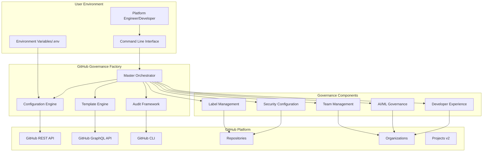
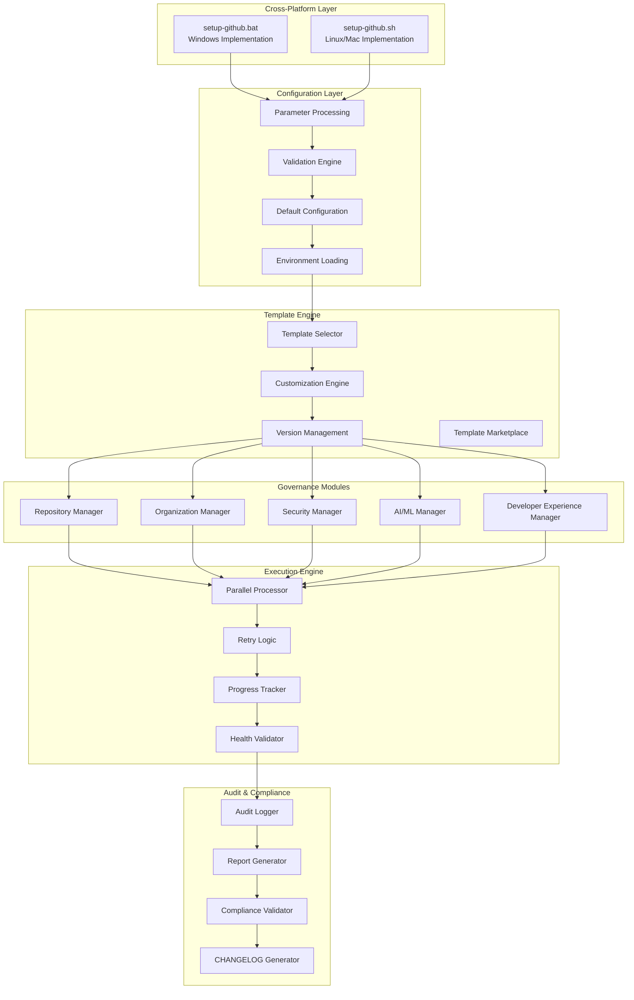

# GitHub Governance Factory Service - System Architecture

## 1. Architecture Overview

The GitHub Governance Factory Service is designed as a universal, zero-hardcoded bootstrap engine that transforms ANY GitHub organization or repository into a fully governed, enterprise-ready development ecosystem. The architecture emphasizes reusability, scalability, and comprehensive governance coverage while maintaining simplicity and performance.

## 2. High-Level Architecture

### 2.1 System Context Diagram



### 2.2 Component Architecture



## 3. Detailed Component Design

### 3.1 Master Orchestrator

**Purpose**: Central coordination engine that manages the entire governance bootstrap process

**Key Responsibilities**:
- Parameter processing and validation
- Template selection and configuration
- Component orchestration and execution
- Error handling and recovery
- Progress tracking and reporting

**Implementation Architecture**:
```bash
# Windows Implementation (setup-github.bat)
@echo off
ECHO Enterprise GitHub Governance Factory v2.0

REM Phase 1: Configuration Loading
CALL :LoadConfiguration
CALL :ValidateParameters  
CALL :ConfirmExecution

REM Phase 2: GitHub Authentication
CALL :ValidateGitHubAuth
CALL :SetupWorkspace

REM Phase 3: Repository Infrastructure
CALL :CreateRepository
CALL :ConfigureLabels
CALL :ConfigureVariables
CALL :ConfigureSecrets

REM Phase 4: Organization Management
IF NOT "%ORG_NAME%"=="@me" (
    CALL :ConfigureOrganization
    CALL :ConfigureTeams
    CALL :ConfigureOrgSecrets
)

REM Phase 5: Security & Compliance
CALL :ConfigureSecurity
CALL :ConfigureCompliance
CALL :ConfigureAudit

REM Phase 6: Developer Experience
CALL :ConfigureCodespaces
CALL :ConfigureCopilot
CALL :ConfigureWorkflows

REM Phase 7: Validation & Documentation
CALL :ValidateGovernance
CALL :GenerateDocumentation
CALL :UpdateChangelog
CALL :CreateAuditTrail

ECHO ✅ Enterprise GitHub Governance Factory Setup Complete!
```

**Linux/Mac Implementation (setup-github.sh)**:
```bash
#!/bin/bash
echo "Enterprise GitHub Governance Factory v2.0"

# Phase 1: Configuration Loading
load_configuration
validate_parameters
confirm_execution

# Phase 2: GitHub Authentication  
validate_github_auth
setup_workspace

# Phase 3: Repository Infrastructure
create_repository
configure_labels
configure_variables
configure_secrets

# Phase 4: Organization Management
if [ "$ORG_NAME" != "@me" ]; then
    configure_organization
    configure_teams
    configure_org_secrets
fi

# Phase 5: Security & Compliance
configure_security
configure_compliance
configure_audit

# Phase 6: Developer Experience
configure_codespaces
configure_copilot
configure_workflows

# Phase 7: Validation & Documentation
validate_governance
generate_documentation
update_changelog
create_audit_trail

echo "✅ Enterprise GitHub Governance Factory Setup Complete!"
```

### 3.2 Configuration Engine

**Purpose**: Unified configuration management with multiple input sources and validation

**Configuration Sources Hierarchy**:
1. **Command Line Arguments** (highest priority)
2. **Environment Variables** 
3. **Configuration File (.env)**
4. **Interactive Prompts**
5. **System Defaults** (lowest priority)

**Configuration Schema**:
```yaml
# Core Configuration
organization:
  name: "${ORG_NAME}"           # GitHub organization or @me
  type: "enterprise|team|personal"  # Auto-detected
  
repository:
  name: "${REPO_NAME}"          # Repository name
  visibility: "private|public"   # Default: private
  template: "auto|custom"        # Template selection
  
project:
  title: "${PROJECT_TITLE}"     # GitHub Project title
  template: "roadmap|kanban"     # Project template
  
governance:
  security_level: "basic|enterprise"  # Security configuration level
  compliance: ["SOX", "GDPR"]          # Compliance frameworks
  audit_level: "standard|comprehensive" # Audit detail level
  
templates:
  primary: "web-app|microservice|data-platform"  # Primary template
  customizations: []                              # Custom configurations
  
features:
  copilot: true                  # Enable GitHub Copilot governance
  codespaces: true              # Configure Codespaces
  security_scanning: true       # Enable security scanning
  dependabot: true             # Configure Dependabot
```

**Configuration Validation**:
```bash
# Parameter Validation Function
validate_configuration() {
    echo "🔍 Validating configuration..."
    
    # Organization validation
    if [ "$ORG_NAME" = "" ]; then
        echo "❌ ERROR: Organization name required"
        exit 1
    fi
    
    # Repository validation
    if [ "$REPO_NAME" = "" ]; then
        echo "❌ ERROR: Repository name required"
        exit 1
    fi
    
    # GitHub authentication validation
    if ! gh auth status >/dev/null 2>&1; then
        echo "❌ ERROR: GitHub CLI not authenticated"
        exit 1
    fi
    
    # Organization permissions validation
    if [ "$ORG_NAME" != "@me" ]; then
        if ! gh api orgs/$ORG_NAME >/dev/null 2>&1; then
            echo "❌ ERROR: No access to organization $ORG_NAME"
            exit 1
        fi
    fi
    
    echo "✅ Configuration validated successfully"
}
```

### 3.3 Template Engine

**Purpose**: Flexible template system supporting multiple project types with customization capabilities

**Template Architecture**:
```yaml
# Template Definition Structure
templates/
├── web-application/
│   ├── template.yml           # Template metadata and configuration
│   ├── governance/            # Governance-specific configurations
│   │   ├── labels.yml        # Label taxonomy
│   │   ├── variables.yml     # Repository variables
│   │   ├── secrets.yml       # Secret templates
│   │   └── security.yml      # Security configuration
│   ├── workflows/             # GitHub Actions workflows
│   │   ├── ci.yml           # Continuous Integration
│   │   ├── cd.yml           # Continuous Deployment
│   │   └── security.yml     # Security scanning
│   └── docs/                  # Documentation templates
│       ├── README.md         # Project README template
│       ├── CONTRIBUTING.md   # Contribution guidelines
│       └── SECURITY.md       # Security policy
├── microservice/
│   └── [similar structure]
└── data-platform/
    └── [similar structure]
```

**Template Selection Logic**:
```bash
# Intelligent Template Selection
select_template() {
    local project_type="$1"
    local organization_type="$2"
    
    case "$project_type" in
        "auto")
            # Analyze project context and select appropriate template
            if detect_web_application; then
                TEMPLATE="web-application"
            elif detect_microservice; then
                TEMPLATE="microservice"
            elif detect_data_platform; then
                TEMPLATE="data-platform"
            else
                TEMPLATE="general-purpose"
            fi
            ;;
        *)
            TEMPLATE="$project_type"
            ;;
    esac
    
    # Apply organization-specific customizations
    case "$organization_type" in
        "enterprise")
            apply_enterprise_governance
            ;;
        "team")
            apply_team_governance
            ;;
        "personal")
            apply_personal_governance
            ;;
    esac
    
    echo "📋 Selected template: $TEMPLATE for $organization_type organization"
}
```

### 3.4 Governance Modules

#### 3.4.1 Repository Manager

**Purpose**: Complete repository infrastructure setup with security and governance controls

**Key Functions**:
- Repository creation with appropriate settings
- Label taxonomy deployment (17+ enterprise categories)
- Repository variables configuration (23+ CI/CD variables)
- Repository secrets management (12+ secrets with rotation)
- Branch protection and merge policies

**Implementation**:
```bash
# Repository Infrastructure Setup
setup_repository_infrastructure() {
    echo "🏗️ Setting up repository infrastructure..."
    
    # Create repository if it doesn't exist
    if ! gh repo view "$ORG_NAME/$REPO_NAME" >/dev/null 2>&1; then
        gh repo create "$ORG_NAME/$REPO_NAME" \
            --private \
            --description "Enterprise-governed repository" \
            --add-readme
        echo "✅ Repository created: $ORG_NAME/$REPO_NAME"
    else
        echo "ℹ️ Repository already exists: $ORG_NAME/$REPO_NAME"
    fi
    
    # Deploy label taxonomy
    deploy_label_taxonomy
    
    # Configure repository variables
    configure_repository_variables
    
    # Deploy repository secrets
    deploy_repository_secrets
    
    # Configure branch protection
    configure_branch_protection
    
    echo "✅ Repository infrastructure setup complete"
}

# Label Taxonomy Deployment
deploy_label_taxonomy() {
    echo "🏷️ Deploying label taxonomy..."
    
    # Epic/Feature/Task Hierarchy
    gh label create "epic" --description "🎯 Epic-level strategic initiative" --color "8B5CF6"
    gh label create "feature" --description "✨ Feature implementation" --color "10B981"  
    gh label create "task" --description "📝 Development task" --color "3B82F6"
    
    # Priority Labels
    gh label create "priority-critical" --description "🔴 Critical priority" --color "DC2626"
    gh label create "priority-high" --description "🟠 High priority" --color "EA580C"
    gh label create "priority-medium" --description "🟡 Medium priority" --color "D97706"
    gh label create "priority-low" --description "🟢 Low priority" --color "16A34A"
    
    # Status Labels
    gh label create "status-backlog" --description "📋 Backlog" --color "6B7280"
    gh label create "status-ready" --description "✅ Ready for development" --color "059669"
    gh label create "status-in-progress" --description "🚧 In progress" --color "2563EB"
    gh label create "status-review" --description "👀 Under review" --color "7C3AED"
    gh label create "status-testing" --description "🧪 Testing" --color "DC2626"
    gh label create "status-blocked" --description "⛔ Blocked" --color "991B1B"
    
    # Component Labels
    gh label create "backend" --description "⚙️ Backend component" --color "374151"
    gh label create "frontend" --description "🎨 Frontend component" --color "EC4899"
    gh label create "infrastructure" --description "🏗️ Infrastructure" --color "0F172A"
    gh label create "security" --description "🔒 Security-related" --color "7F1D1D"
    
    echo "✅ Label taxonomy deployed"
}
```

#### 3.4.2 Organization Manager

**Purpose**: Complete organization infrastructure with teams, permissions, and governance

**Key Functions**:
- Team structure creation with hierarchical permissions
- Role-based access control (RBAC) implementation
- Organization-level secrets and variables
- Organization security policies and compliance
- Organization metadata and branding

**Implementation**:
```bash
# Organization Infrastructure Setup
setup_organization_infrastructure() {
    echo "🏢 Setting up organization infrastructure..."
    
    # Create team structure
    create_team_structure
    
    # Configure role-based access control
    configure_rbac
    
    # Deploy organization secrets
    deploy_org_secrets
    
    # Configure organization policies
    configure_org_policies
    
    # Setup organization metadata
    configure_org_metadata
    
    echo "✅ Organization infrastructure setup complete"
}

# Team Structure Creation
create_team_structure() {
    echo "👥 Creating team structure..."
    
    # Core development teams
    gh api orgs/$ORG_NAME/teams \
        --method POST \
        --field name="engineering" \
        --field description="Engineering team with write access" \
        --field privacy="closed"
    
    gh api orgs/$ORG_NAME/teams \
        --method POST \
        --field name="security" \
        --field description="Security team with admin access" \
        --field privacy="secret"
    
    gh api orgs/$ORG_NAME/teams \
        --method POST \
        --field name="operations" \
        --field description="DevOps and operations team" \
        --field privacy="closed"
    
    # Configure team permissions
    gh api orgs/$ORG_NAME/teams/engineering/repos/$ORG_NAME/$REPO_NAME \
        --method PUT \
        --field permission="push"
    
    gh api orgs/$ORG_NAME/teams/security/repos/$ORG_NAME/$REPO_NAME \
        --method PUT \
        --field permission="admin"
    
    gh api orgs/$ORG_NAME/teams/operations/repos/$ORG_NAME/$REPO_NAME \
        --method PUT \
        --field permission="maintain"
    
    echo "✅ Team structure created"
}
```

#### 3.4.3 Security Manager

**Purpose**: Comprehensive security controls and vulnerability management

**Key Functions**:
- CodeQL security scanning configuration
- Dependabot vulnerability management
- Secret scanning with custom patterns
- Security policy enforcement
- Compliance validation and reporting

**Implementation**:
```bash
# Security Configuration Setup
setup_security_configuration() {
    echo "🔒 Setting up security configuration..."
    
    # Enable security features
    enable_security_scanning
    
    # Configure Dependabot
    configure_dependabot
    
    # Setup secret scanning
    configure_secret_scanning
    
    # Deploy security policies
    deploy_security_policies
    
    echo "✅ Security configuration setup complete"
}

# CodeQL Security Scanning
enable_security_scanning() {
    echo "🔍 Enabling CodeQL security scanning..."
    
    # Create CodeQL workflow
    mkdir -p .github/workflows
    cat > .github/workflows/codeql.yml << 'EOF'
name: "CodeQL Security Analysis"

on:
  push:
    branches: [ main, develop ]
  pull_request:
    branches: [ main ]
  schedule:
    - cron: '0 2 * * 1'  # Weekly on Monday at 2 AM

jobs:
  analyze:
    name: Analyze
    runs-on: ubuntu-latest
    permissions:
      actions: read
      contents: read
      security-events: write

    strategy:
      fail-fast: false
      matrix:
        language: [ 'javascript', 'python', 'java', 'csharp', 'cpp', 'go' ]

    steps:
    - name: Checkout repository
      uses: actions/checkout@v4

    - name: Initialize CodeQL
      uses: github/codeql-action/init@v3
      with:
        languages: ${{ matrix.language }}
        queries: security-extended,security-and-quality

    - name: Autobuild
      uses: github/codeql-action/autobuild@v3

    - name: Perform CodeQL Analysis
      uses: github/codeql-action/analyze@v3
      with:
        category: "/language:${{matrix.language}}"
EOF

    # Commit security configuration
    git add .github/workflows/codeql.yml
    git commit -m "feat(security): enable CodeQL security scanning"
    git push origin main
    
    echo "✅ CodeQL security scanning enabled"
}
```

#### 3.4.4 AI/ML Manager

**Purpose**: Comprehensive GitHub Copilot and AI governance

**Key Functions**:
- GitHub Copilot Business licensing and seat management
- AI usage policies and restrictions
- Context filtering and boundary protection
- Model governance and approval workflows
- AI audit trails and compliance reporting

**Implementation**:
```bash
# AI/ML Governance Setup
setup_ai_governance() {
    echo "🤖 Setting up AI/ML governance..."
    
    # Configure Copilot licensing
    configure_copilot_licensing
    
    # Setup AI usage policies
    configure_ai_policies
    
    # Configure context boundaries
    configure_context_filtering
    
    # Setup model governance
    configure_model_governance
    
    echo "✅ AI/ML governance setup complete"
}

# Copilot Business Configuration
configure_copilot_licensing() {
    echo "💼 Configuring GitHub Copilot Business..."
    
    # Enable Copilot for organization
    gh api orgs/$ORG_NAME/copilot/billing \
        --method PUT \
        --field seat_management_setting="assign_selected" \
        --field public_code_suggestions="block"
    
    # Configure team-based access
    gh api orgs/$ORG_NAME/copilot/billing/selected_teams \
        --method PUT \
        --field selected_teams='["engineering", "operations"]'
    
    # Block Copilot for security team (sensitive work)
    gh api orgs/$ORG_NAME/copilot/billing/selected_teams/security \
        --method DELETE
    
    echo "✅ Copilot Business licensing configured"
}

# AI Usage Policies
configure_ai_policies() {
    echo "📋 Configuring AI usage policies..."
    
    # Create AI usage policy document
    cat > .github/AI_USAGE_POLICY.md << 'EOF'
# AI Usage Policy

## GitHub Copilot Usage Guidelines

### Approved Usage
- ✅ Code generation for non-sensitive functionality
- ✅ Code documentation and comments
- ✅ Test case generation and validation
- ✅ Refactoring and optimization suggestions

### Restricted Usage  
- ❌ Generation of authentication or security code
- ❌ Processing of sensitive customer data
- ❌ Generation of cryptographic functions
- ❌ Code involving regulatory compliance requirements

### Model Governance
- **Production Approved**: GPT-4, GPT-3.5-turbo, Claude-3
- **Development Only**: Experimental and beta models
- **Prohibited**: Non-enterprise models, local models

### Audit Requirements
- All AI-generated code must be reviewed by human developers
- AI usage decisions must be documented in pull requests
- Compliance-sensitive code requires additional security review
EOF

    git add .github/AI_USAGE_POLICY.md
    git commit -m "feat(ai): add AI usage policy and guidelines"
    
    echo "✅ AI usage policies configured"
}
```

### 3.5 Execution Engine

**Purpose**: Efficient, reliable execution of governance operations with monitoring and recovery

**Key Components**:
- Parallel processing for independent operations
- Retry logic with exponential backoff
- Progress tracking and user feedback
- Health validation and verification
- Performance optimization and monitoring

**Implementation**:
```bash
# Parallel Execution Framework
execute_governance_components() {
    echo "⚡ Executing governance components in parallel..."
    
    # Start parallel processes for independent components
    {
        setup_repository_infrastructure
        echo "REPO_COMPLETE" > /tmp/governance_status
    } &
    
    {
        if [ "$ORG_NAME" != "@me" ]; then
            setup_organization_infrastructure
            echo "ORG_COMPLETE" > /tmp/governance_status
        fi
    } &
    
    {
        setup_security_configuration
        echo "SECURITY_COMPLETE" > /tmp/governance_status
    } &
    
    {
        setup_ai_governance
        echo "AI_COMPLETE" > /tmp/governance_status
    } &
    
    # Wait for all parallel processes to complete
    wait
    
    echo "✅ All governance components executed successfully"
}

# Retry Logic with Exponential Backoff
retry_with_backoff() {
    local max_attempts=5
    local delay=1
    local attempt=1
    
    while [ $attempt -le $max_attempts ]; do
        echo "🔄 Attempt $attempt of $max_attempts..."
        
        if "$@"; then
            echo "✅ Operation succeeded on attempt $attempt"
            return 0
        else
            echo "❌ Operation failed on attempt $attempt"
            
            if [ $attempt -eq $max_attempts ]; then
                echo "💥 Maximum attempts reached, operation failed"
                return 1
            fi
            
            echo "⏳ Waiting ${delay}s before retry..."
            sleep $delay
            delay=$((delay * 2))  # Exponential backoff
            attempt=$((attempt + 1))
        fi
    done
}

# Progress Tracking
track_progress() {
    local total_steps=20
    local current_step=0
    
    echo "📊 Governance setup progress:"
    
    while [ $current_step -lt $total_steps ]; do
        # Check completion status
        if [ -f "/tmp/governance_status" ]; then
            current_step=$((current_step + 1))
            percentage=$((current_step * 100 / total_steps))
            
            # Visual progress bar
            printf "\r🔹 Progress: ["
            for i in $(seq 1 20); do
                if [ $i -le $((current_step * 20 / total_steps)) ]; then
                    printf "█"
                else
                    printf "░"
                fi
            done
            printf "] %d%%" $percentage
        fi
        
        sleep 1
    done
    
    echo ""
    echo "✅ Governance setup completed successfully!"
}
```

### 3.6 Audit Framework

**Purpose**: Comprehensive audit trails and compliance reporting

**Key Components**:
- Immutable audit logging with correlation IDs
- Real-time audit event processing
- Compliance report generation
- CHANGELOG automation
- GitHub Issues integration for traceability

**Implementation**:
```bash
# Audit Trail Generation
generate_audit_trail() {
    local correlation_id=$(uuidgen)
    local timestamp=$(date -u +"%Y-%m-%dT%H:%M:%SZ")
    
    echo "📋 Generating audit trail with correlation ID: $correlation_id"
    
    # Create audit event
    cat > "audit_${correlation_id}.json" << EOF
{
  "correlation_id": "$correlation_id",
  "timestamp": "$timestamp",
  "operation": "github_governance_bootstrap",
  "actor": "$(whoami)",
  "organization": "$ORG_NAME",
  "repository": "$REPO_NAME",
  "project": "$PROJECT_TITLE",
  "template": "$TEMPLATE",
  "operations_completed": [
    "repository_created",
    "labels_deployed",
    "security_configured",
    "teams_created",
    "ai_governance_enabled"
  ],
  "compliance_frameworks": ["SOX", "GDPR", "HIPAA"],
  "status": "completed"
}
EOF

    # Update CHANGELOG
    update_changelog "$correlation_id"
    
    # Create GitHub Issues for traceability
    create_governance_issues "$correlation_id"
    
    echo "✅ Audit trail generated successfully"
}

# CHANGELOG Generation
update_changelog() {
    local correlation_id="$1"
    local date=$(date +"%Y-%m-%d")
    
    # Add to CHANGELOG.md
    cat > CHANGELOG_temp.md << EOF
# Changelog

## [Unreleased]

### Added
- **feat(governance): universal GitHub governance factory implementation (#$correlation_id)**
  - Parametrized org/repo/project configuration for $ORG_NAME/$REPO_NAME
  - Zero hardcoding with environment variable support
  - Complete governance coverage across all GitHub domains
  - AI/ML governance with Copilot Business licensing
  - Enterprise security scanning and vulnerability management
  - Automated audit trails and compliance reporting

$(if [ -f CHANGELOG.md ]; then tail -n +3 CHANGELOG.md; fi)
EOF

    mv CHANGELOG_temp.md CHANGELOG.md
    git add CHANGELOG.md
    git commit -m "docs(changelog): add governance factory implementation #$correlation_id"
    
    echo "✅ CHANGELOG updated"
}
```

## 4. Data Architecture

### 4.1 Configuration Data Model

```yaml
# Configuration Schema
Configuration:
  metadata:
    version: "2.0"
    created: "2025-01-02T10:30:00Z"
    correlation_id: "gov-2025-001-abc123"
    
  organization:
    name: string                    # GitHub organization name or @me
    type: enum[personal, team, enterprise]
    size: number                    # Estimated team size
    compliance: array[string]       # Required compliance frameworks
    
  repository:
    name: string                    # Repository name
    visibility: enum[public, private]
    template: string                # Template identifier
    customizations: object          # Template customizations
    
  governance:
    security_level: enum[basic, standard, enterprise]
    audit_level: enum[minimal, standard, comprehensive]
    features: object                # Feature flags
    
  teams:
    structure: array[Team]          # Team definitions
    permissions: object             # Permission matrix
    
  templates:
    primary: string                 # Primary template
    customizations: array[object]   # Custom configurations
    
  audit:
    enabled: boolean
    frameworks: array[string]       # Compliance frameworks
    retention: number               # Audit log retention days
```

### 4.2 Audit Data Model

```yaml
# Audit Event Schema
AuditEvent:
  correlation_id: string           # Unique operation identifier
  timestamp: datetime              # ISO 8601 timestamp
  event_type: string              # Event classification
  actor: string                   # User or system performing action
  organization: string            # Target organization
  repository: string              # Target repository (if applicable)
  operation: string               # Specific operation performed
  before_state: object            # State before operation
  after_state: object             # State after operation
  metadata: object                # Additional context
  compliance_tags: array[string]  # Compliance framework relevance
  status: enum[success, failure, pending]
  error_details: string           # Error information (if applicable)
```

### 4.3 Template Data Model

```yaml
# Template Schema
Template:
  metadata:
    name: string                   # Template identifier
    version: string                # Template version
    description: string            # Template description
    author: string                 # Template author
    tags: array[string]            # Template categories
    
  governance:
    labels: array[Label]           # Label definitions
    variables: array[Variable]     # Variable definitions
    secrets: array[Secret]         # Secret templates
    policies: array[Policy]        # Security policies
    
  workflows:
    ci: object                     # CI workflow definition
    cd: object                     # CD workflow definition
    security: object               # Security workflow definition
    
  documentation:
    readme: string                 # README template
    contributing: string           # CONTRIBUTING template
    security: string               # SECURITY template
    
  customization:
    parameters: array[Parameter]   # Customizable parameters
    rules: array[Rule]             # Customization rules
```

## 5. Security Architecture

### 5.1 Authentication and Authorization

**Multi-Tier Access Control**:
```yaml
# Access Control Matrix
AccessControl:
  authentication:
    github_cli: required           # GitHub CLI authentication
    personal_access_token: optional # Alternative auth method
    github_app: optional           # GitHub App integration
    
  authorization:
    personal_account:
      permissions: [repo_create, repo_admin]
      scope: "user repositories only"
      
    team_organization:
      permissions: [org_read, repo_create, team_manage]
      scope: "organization repositories and teams"
      
    enterprise_organization:
      permissions: [org_admin, repo_admin, team_admin, security_admin]
      scope: "full organization control"
      
  security_controls:
    token_rotation: enabled        # Automatic token rotation
    least_privilege: enforced      # Minimal required permissions
    audit_logging: comprehensive   # Complete access logging
```

### 5.2 Data Protection

**Encryption and Secret Management**:
```bash
# Secret Management Framework
manage_secrets() {
    echo "🔐 Managing secrets with enterprise security..."
    
    # Generate secure random secrets
    generate_secure_secret() {
        local secret_name="$1"
        local secret_value=$(openssl rand -base64 32)
        
        # Store in GitHub repository secrets
        gh secret set "$secret_name" --body "$secret_value"
        
        # Log secret creation (without value)
        log_audit_event "secret_created" "$secret_name" "$(date -u +%Y-%m-%dT%H:%M:%SZ)"
        
        echo "✅ Secret $secret_name created and stored securely"
    }
    
    # Repository secrets
    generate_secure_secret "DATABASE_PASSWORD"
    generate_secure_secret "API_SECRET_KEY"
    generate_secure_secret "JWT_SIGNING_KEY"
    generate_secure_secret "ENCRYPTION_KEY"
    generate_secure_secret "WEBHOOK_SECRET"
    
    # CI/CD secrets
    generate_secure_secret "DOCKER_REGISTRY_TOKEN"
    generate_secure_secret "DEPLOYMENT_KEY"
    generate_secure_secret "MONITORING_API_KEY"
    
    echo "✅ All secrets generated and stored securely"
}
```

### 5.3 Compliance Framework

**Regulatory Compliance Support**:
```yaml
# Compliance Configuration
ComplianceFrameworks:
  SOX:
    audit_retention: 2555 days     # 7 years
    immutable_logs: required
    change_approval: required
    segregation_of_duties: enforced
    
  GDPR:
    data_protection: enabled
    audit_retention: 1095 days     # 3 years
    right_to_erasure: supported
    data_encryption: required
    
  HIPAA:
    access_logging: comprehensive
    encryption_at_rest: required
    encryption_in_transit: required
    audit_retention: 2190 days     # 6 years
    
  ISO27001:
    security_controls: comprehensive
    risk_assessment: automated
    incident_response: enabled
    continuous_monitoring: required
```

## 6. Performance Architecture

### 6.1 Scalability Design

**Performance Optimization Strategy**:
```bash
# Performance Optimization Framework
optimize_performance() {
    local org_size="$1"
    local repo_count="$2"
    
    case "$org_size" in
        "personal")
            # Optimized for single developer
            PARALLEL_JOBS=2
            BATCH_SIZE=10
            CACHE_TTL=3600
            ;;
        "team")
            # Optimized for small teams (5-20 developers)
            PARALLEL_JOBS=4
            BATCH_SIZE=25
            CACHE_TTL=1800
            ;;
        "enterprise")
            # Optimized for large organizations (100+ developers)
            PARALLEL_JOBS=8
            BATCH_SIZE=50
            CACHE_TTL=900
            ;;
    esac
    
    echo "🚀 Performance optimized for $org_size organization"
    echo "   Parallel jobs: $PARALLEL_JOBS"
    echo "   Batch size: $BATCH_SIZE"
    echo "   Cache TTL: $CACHE_TTL seconds"
}
```

### 6.2 Monitoring and Observability

**Comprehensive Monitoring Framework**:
```bash
# Health Check and Monitoring
perform_health_checks() {
    echo "🏥 Performing comprehensive health checks..."
    
    # Repository health
    check_repository_health() {
        local repo="$1"
        
        # Check repository access
        if gh repo view "$repo" >/dev/null 2>&1; then
            echo "✅ Repository accessible: $repo"
        else
            echo "❌ Repository inaccessible: $repo"
            return 1
        fi
        
        # Check branch protection
        if gh api repos/$repo/branches/main/protection >/dev/null 2>&1; then
            echo "✅ Branch protection enabled: $repo"
        else
            echo "⚠️ Branch protection missing: $repo"
        fi
        
        # Check security scanning
        if gh api repos/$repo/code-scanning/analyses >/dev/null 2>&1; then
            echo "✅ Security scanning enabled: $repo"
        else
            echo "⚠️ Security scanning not configured: $repo"
        fi
    }
    
    # Organization health (if applicable)
    check_organization_health() {
        local org="$1"
        
        if [ "$org" = "@me" ]; then
            echo "ℹ️ Personal account mode - skipping organization checks"
            return 0
        fi
        
        # Check organization access
        if gh api orgs/$org >/dev/null 2>&1; then
            echo "✅ Organization accessible: $org"
        else
            echo "❌ Organization inaccessible: $org"
            return 1
        fi
        
        # Check team structure
        if gh api orgs/$org/teams >/dev/null 2>&1; then
            echo "✅ Teams configured: $org"
        else
            echo "⚠️ No teams configured: $org"
        fi
    }
    
    # Perform all health checks
    check_repository_health "$ORG_NAME/$REPO_NAME"
    check_organization_health "$ORG_NAME"
    
    echo "✅ Health checks completed"
}
```

## 7. Integration Architecture

### 7.1 GitHub API Integration

**Comprehensive API Coverage**:
```bash
# GitHub API Integration Layer
class GitHubAPIManager {
    # REST API Integration
    perform_rest_operation() {
        local endpoint="$1"
        local method="$2"
        local data="$3"
        
        # Rate limit handling
        check_rate_limit
        
        # Execute API call with retry logic
        retry_with_backoff gh api "$endpoint" \
            --method "$method" \
            --input "$data"
    }
    
    # GraphQL API Integration  
    perform_graphql_operation() {
        local query="$1"
        local variables="$2"
        
        # Rate limit handling for GraphQL
        check_graphql_rate_limit
        
        # Execute GraphQL query
        retry_with_backoff gh api graphql \
            --field query="$query" \
            --field variables="$variables"
    }
    
    # Rate Limit Management
    check_rate_limit() {
        local remaining=$(gh api rate_limit | jq '.rate.remaining')
        local reset_time=$(gh api rate_limit | jq '.rate.reset')
        
        if [ "$remaining" -lt 100 ]; then
            local wait_time=$((reset_time - $(date +%s)))
            echo "⏳ Rate limit approaching, waiting ${wait_time}s..."
            sleep "$wait_time"
        fi
    }
}
```

### 7.2 External Tool Integration

**Enterprise System Integration**:
```yaml
# Integration Configuration
Integrations:
  security_tools:
    sonarqube:
      enabled: optional
      webhook_url: "${SONARQUBE_WEBHOOK_URL}"
      quality_gate: "enterprise"
      
    veracode:
      enabled: optional
      api_key: "${VERACODE_API_KEY}"
      scan_policy: "comprehensive"
      
  monitoring_tools:
    prometheus:
      enabled: optional
      scrape_interval: "30s"
      metrics_endpoint: "/metrics"
      
    grafana:
      enabled: optional
      dashboard_import: "github-governance"
      
  compliance_tools:
    compliance_manager:
      enabled: optional
      webhook_url: "${COMPLIANCE_WEBHOOK_URL}"
      frameworks: ["SOX", "GDPR", "HIPAA"]
```

## 8. Deployment Architecture

### 8.1 Distribution Strategy

**Multi-Platform Distribution**:
```yaml
# Distribution Packages
Distribution:
  standalone:
    format: "git_repository"
    installation: "git clone + chmod +x"
    platforms: ["windows", "linux", "macos"]
    
  package_managers:
    windows:
      chocolatey: "choco install github-governance-factory"
      winget: "winget install GitHubGovernanceFactory"
      
    linux:
      apt: "apt install github-governance-factory"
      yum: "yum install github-governance-factory"
      snap: "snap install github-governance-factory"
      
    macos:
      homebrew: "brew install github-governance-factory"
      macports: "port install github-governance-factory"
      
  container:
    docker: "docker run --rm ghcr.io/github-governance-factory:latest"
    kubernetes: "kubectl apply -f governance-factory.yaml"
```

### 8.2 Update and Maintenance

**Automated Update Framework**:
```bash
# Update Management System
manage_updates() {
    echo "🔄 Checking for governance factory updates..."
    
    # Check current version
    local current_version=$(cat VERSION)
    local latest_version=$(curl -s https://api.github.com/repos/governance-factory/releases/latest | jq -r '.tag_name')
    
    if [ "$current_version" != "$latest_version" ]; then
        echo "📦 Update available: $current_version → $latest_version"
        
        # Download and install update
        if confirm_update; then
            download_update "$latest_version"
            install_update "$latest_version"
            verify_update "$latest_version"
            echo "✅ Update completed successfully"
        fi
    else
        echo "✅ Governance factory is up to date ($current_version)"
    fi
}
```

---

**Document Version**: 1.0  
**Last Updated**: January 2025  
**Status**: Draft  
**Architect**: Platform Engineering Team  
**Reviewers**: Security Team, DevOps Team, Engineering Leadership  
**Next Review**: January 15, 2025
